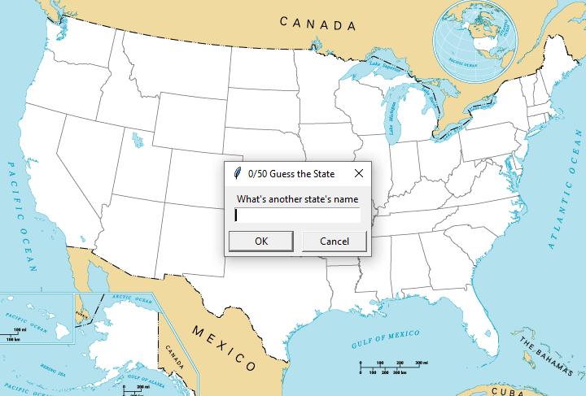
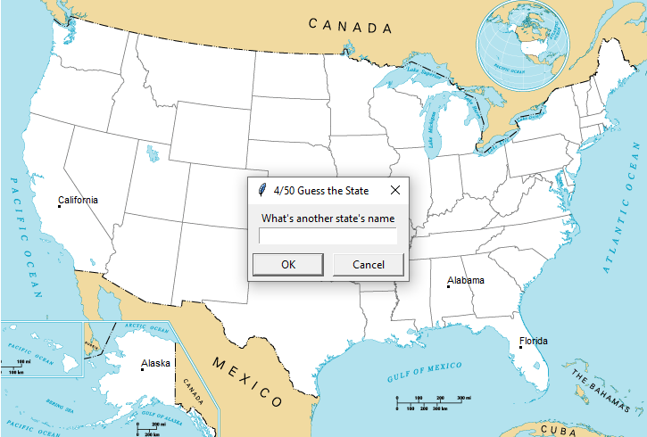

# US State Game
> A game that checks how good you know states of America

## Table of Contents
* [General Info](#general-information)
* [Technologies Used](#technologies-used)
* [Features](#features)
* [Screenshots](#screenshots)
* [Project Status](#project-status)

## General Information
The project foucuses on how good you know states of America. After writing down a correct state name, it goes to a right place on the map.

## Technologies Used
- Python 3.12

## Features
List the ready features here:
- Placing guessed state name onto the map

## Screenshots

## Project Status
Project is: _complete_ 
